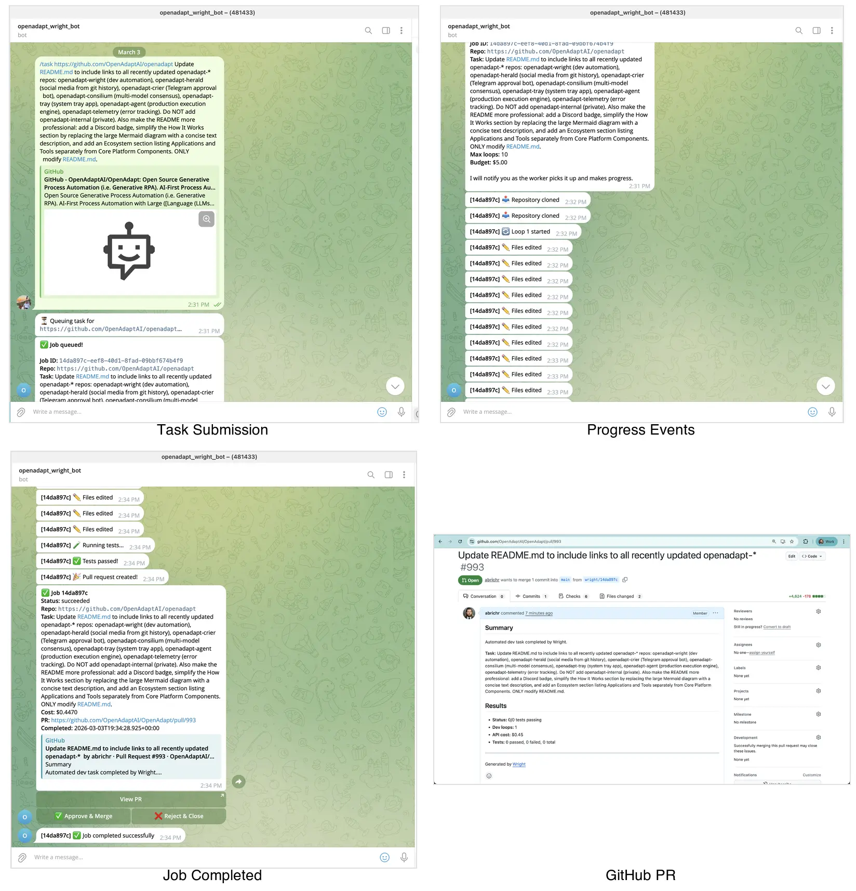
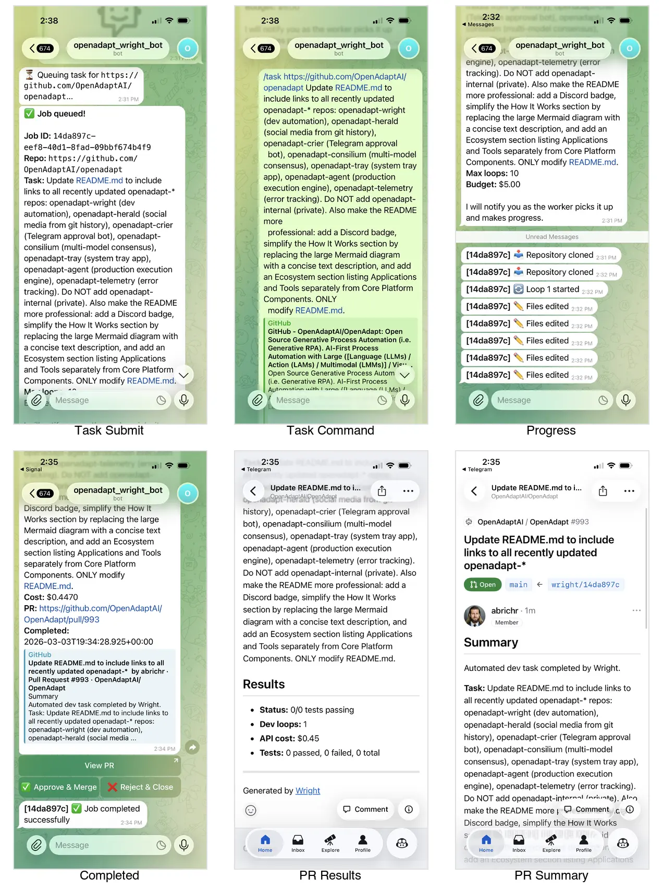

# Wright

Wright is a generalized dev automation platform that takes task descriptions, uses the Claude Agent SDK to generate code, runs tests iteratively (the Ralph Loop pattern), and creates pull requests -- with a Telegram bot for human-in-the-loop approval.

## Demo

Submit a task via Telegram, watch Wright clone the repo, edit code, run tests, and create a PR -- all automated.

### Desktop



### Mobile



## Test Results

**53 tests passing** across 6 test suites, covering the full pipeline from detection to dev loop execution.

```
 ✓ src/__tests__/test-runner.test.ts          (30 tests)  — auto-detection + test execution
 ✓ src/__tests__/test-runner-parsers.test.ts  ( 4 tests)  — pytest/jest/go/cargo output parsing
 ✓ src/__tests__/github-ops.test.ts           ( 4 tests)  — branch creation + commit
 ✓ src/__tests__/dev-loop.test.ts             ( 5 tests)  — full dev loop with mocked externals
 ✓ src/__tests__/queue-poller.test.ts         ( 6 tests)  — job queue state management
 ✓ src/__tests__/index.test.ts                ( 5 tests)  — shared constants + HTTP server

 Test Files  6 passed (6)
      Tests  53 passed (53)
```

### Test Coverage by Component

| Component | What's Tested | Tests |
|-----------|--------------|-------|
| **Test Runner Detection** | Detects pytest, playwright, jest, vitest, go-test, cargo-test from repo files. Verifies priority order (e.g., playwright.config.ts > package.json vitest) | 14 |
| **Package Manager Detection** | Detects uv, poetry, pip, cargo, go, pnpm, yarn, npm from lockfiles. Verifies priority order (e.g., uv.lock > pyproject.toml) | 14 |
| **Test Output Parsing** | Parses real output formats from pytest, jest, go test, cargo test. Verifies pass/fail/skip extraction | 6 |
| **Git Operations** | Creates feature branches, commits files, handles no-changes case. Uses real git repos in temp directories | 4 |
| **Dev Loop (E2E)** | Full pipeline with mocked Claude + Supabase: clone → detect → install → loop → commit → PR. Verifies event emission, budget limits, workdir cleanup | 5 |
| **Queue Poller** | State management: polling status, drain mode, requeue logic, init without env vars | 6 |
| **Shared Constants** | All constants, table names, and status values export correctly | 4 |

### End-to-End Flow Verification

The dev-loop tests prove the full pipeline works by mocking external services:

```
1. cloneRepo()          → Creates a real git repo with package.json + tests
2. createFeatureBranch() → Creates wright/test-1234 branch
3. detectTestRunner()    → Detects 'jest' from package.json
4. detectPackageManager()→ Detects 'npm' from package.json
5. installDependencies() → Runs 'npm install'
6. runClaudeSession()    → Mocked: returns $0.05 cost, 3 turns
7. runTests()            → Executes real 'npx jest --forceExit'
8. commitAndPush()       → Mocked: returns commit SHA abc123def
9. createPullRequest()   → Mocked: returns PR URL
10. cleanup()            → Verifies workdir deleted after completion
```

## Architecture

```
                         Telegram
                            |
                     +------v------+
                     |   Bot       |  (grammY)
                     +------+------+
                            |
                     +------v------+     +-----------+
  GitHub Issue/PR    |  Supabase   |     |  Wright   |
  ───────────────>   |  Job Queue  |────>|  Worker   |
                     +-------------+     +-----+-----+
                                               |
                                         +-----v-----+
                                         | Claude SDK |
                                         |  Dev Loop  |
                                         +-----+-----+
                                               |
                                      +--------v--------+
                                      | clone → detect  |
                                      | → install → edit|  (Ralph Loop)
                                      | → test → fix    |
                                      | → repeat        |
                                      +--------+--------+
                                               |
                                         +-----v-----+
                                         |  GitHub PR |
                                         +-----------+
```

### Ecosystem

Wright is part of the OpenAdapt automation ecosystem:

- **Consilium** -- multi-LLM consensus for project management
- **Herald** -- GitHub webhook listener, routes events to wright
- **Crier** -- multi-channel notification service (Telegram, etc.)
- **Wright** -- dev automation worker (this repo)

### How it works

1. A task arrives (via Telegram bot command, Herald webhook, or direct API call)
2. Wright claims the job from the Supabase queue (atomic, conflict-free)
3. The worker clones the target repo, creates a feature branch
4. Auto-detects the test runner and package manager from repo files
5. Claude Agent SDK iterates: edit code, run tests, fix failures (Ralph Loop)
6. On success (or budget exhaustion), wright commits, pushes, and creates a PR
7. Bot notifies the human via Telegram for review/approval

### Supported Languages & Test Runners

| Language | Test Runner | Package Manager | Detection Method |
|----------|------------|-----------------|-----------------|
| Python | pytest | uv, pip, poetry | `pyproject.toml`, `uv.lock`, `requirements.txt` |
| TypeScript/JavaScript | vitest, jest, playwright | pnpm, npm, yarn | `package.json` devDependencies, lockfiles |
| Rust | cargo test | cargo | `Cargo.toml` |
| Go | go test | go | `go.mod` |

## Monorepo Structure

```
wright/
  apps/
    worker/       # Fly.io: generalized dev loop (scale-to-zero)
      src/
        index.ts           # HTTP server (health, drain, cancel)
        queue-poller.ts    # Supabase job queue polling + claiming
        dev-loop.ts        # Ralph Loop orchestrator
        claude-session.ts  # Claude Agent SDK wrapper
        test-runner.ts     # Auto-detect + run test suites
        github-ops.ts      # Clone, branch, commit, push, PR
        __tests__/         # 53 tests across 6 test files
    bot/          # Fly.io: always-on Telegram bot (grammY)
  packages/
    shared/       # Shared types + constants
  supabase/
    migrations/   # Database schema (job_queue, job_events, test_results)
```

## Quick Start

```bash
# Prerequisites: Node.js 22+, pnpm 9+
pnpm install
pnpm build

# Run tests
pnpm --filter @wright/worker test

# Set environment variables
export SUPABASE_URL=https://your-project.supabase.co
export SUPABASE_SERVICE_ROLE_KEY=your-key
export ANTHROPIC_API_KEY=sk-ant-your-key

# Run the worker locally
pnpm --filter @wright/worker dev

# Run the Telegram bot locally
export BOT_TOKEN=your-telegram-bot-token
pnpm --filter @wright/bot dev
```

## Deployment

The worker runs on Fly.io with scale-to-zero:

```bash
# Deploy worker
cd apps/worker
fly deploy

# The worker automatically:
# - Starts on HTTP request (Fly.io auto-start)
# - Polls Supabase for queued jobs
# - Shuts down after 5 minutes idle (scale-to-zero)
# - Re-queues jobs on SIGTERM (graceful shutdown)
```

## Plan

See the full design document: [wright plan](https://github.com/OpenAdaptAI/openadapt-wright/blob/main/PLAN.md)
